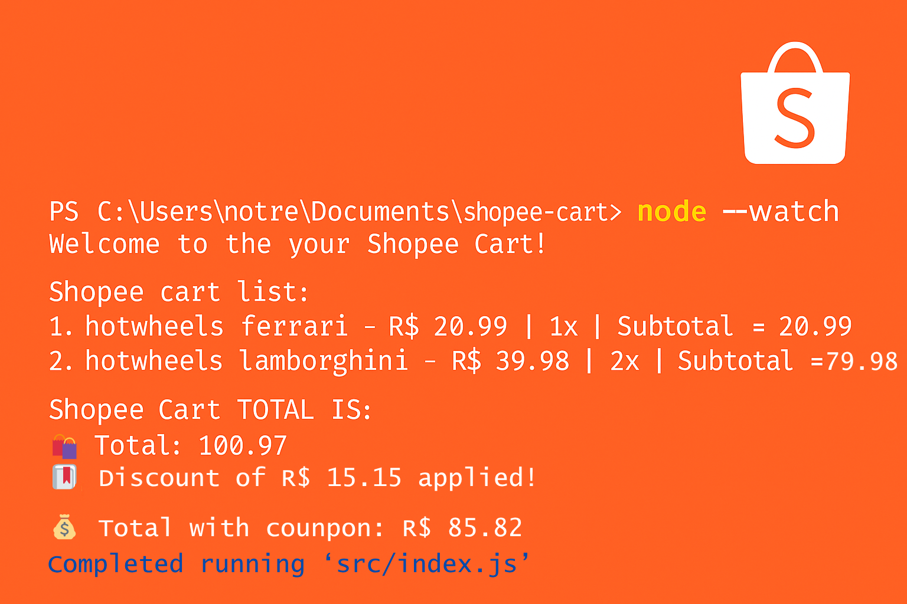

# 🛒 Recriando a lógica do carrinho de compras da Shopee  

  <table>
        <tr>
            <td>
                
            </td>
            <td>
   <b>🎯 Objetivo:</b>
   <p>
  Este projeto tem como objetivo recriar a lógica de um carrinho de compras inspirado no modelo da Shopee.  
  O carrinho permite armazenar itens, calcular automaticamente subtotais e o total geral.  
  Além disso, foi implementado um sistema de <strong>cupons de desconto</strong> que inclui:  
  frete grátis, cashback, descontos fixos e descontos progressivos — simulando o comportamento real de uma loja online.
</p>
     </td>
        </tr>
    </table>

## Habilidades Desenvolvidas
- **Modularização** (nível intermediário)  
- **Domínio da aplicação:** Carrinho de compras  
- **Boas práticas de organização de código**  


### 📂 Entidades representadas  
- `cart.js` → Lógica do carrinho  
- `item.js` → Lógica dos itens  

---

<h3> Como executar o projeto localmente:</h3>

1. **Pré-requisito:** Certifique-se de ter o **[Node.js](https://nodejs.org/)** na versão `v20.18.0` ou superior instalado.  

2. Clone o repositório:  
   ```bash
   git clone https://github.com/Jezebel1990/shopee-cart.git
   ```

3. Acesse a pasta do projeto:
```bash
cd shopee-cart
```
4. Execute o projeto:
```bash
node src/index.js
```

Feito com ♥ por [Jezebel Guedes](https://www.linkedin.com/in/jezebel-guedes/) 👋 Entre em contato!